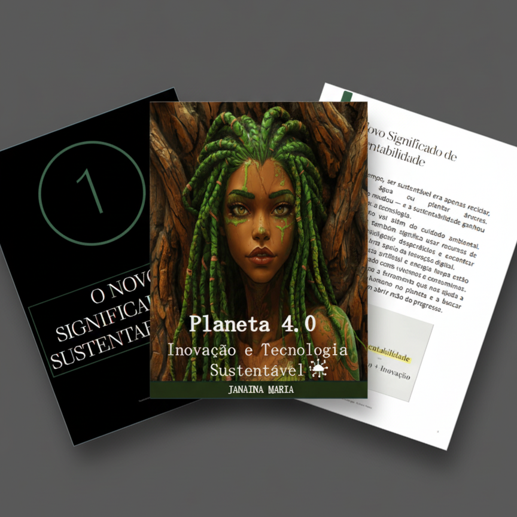

# Projeto EBOOK Gerado por I.A.s

 > ℹ️ **NOTE:** Este é o repositório desenvolvido durante uma Boootcamp fornecido pelo [DIO](https://dio.me)

Projeto com o objetivo de gerar um ebook digital com as facilidades das ferramentas de IA. 

<a href="output/Ebook - Sustentabilidade e tecnologia.pdf" title="View PDF now"> 📕Clique aqui para ler</a>

## 💻 Tecnologias utilizadas no projeto

- [ChatGPT](https://chat.openai.com/) 
- [Leonardo.Ai](https://leonardo.ai/)
- [PowerPoint](https://www.microsoft.com/en/microsoft-365/powerpoint)

## 🧠 Prompts

ChatGPT：

|   Ação   | prompt                                                                                                                                                                                                                                                                         |
| :------: | ------------------------------------------------------------------------------------------------------------------------------------------------------------------------------------------------------------------------------------------------------------------------------ |
|  título  | crie um titulo para ebook sobre o tema de sustentabilidade, o ebook é do nicho de tecnologia e o subnicho é de sustentabilidade. O título deve ser curto e direto, e tenha uma temática voltada para natureza e tecnologia. Me liste 5 variações de títulos.                                                    |
| conteúdo | faça um texto para ebook, com foco em sustentabilidade, listando mudanças que a sustentabilidade teve com tecnologia.Além disso, liste 5 reflexões sobre o tema para deixa as pessoas curiosas e pensativas. regras: explique sempre de maneira simples,contenha 3 capítulos completos e explicativos, deixe o texto enxuto, sempre deixa um titulo sugestivo por tópico. |

Leonardo.AI：

|  Ação  | prompt                                                                                 |
| :----: | -------------------------------------------------------------------------------------- |
| título | Crie uma arte parecida com anime sendo uma mulher com dreads verde e o rosto e pescoço sendo de madeira como se fosse uma árvore.  |

## ✨ Features

- Conteúdo gerado via ChatGPT
- Imagens geradas via Leonardo.Ai

## 🛠️ Instruções de execução

Utilize os prompts acima nas ferramentas sugeridas para gerar o material base e utilize uma ferramenta de edição de documentos como power point, libreoffice , indesign para diagramação.

## 👨‍💻 Expert

    
Janaina Maria 
    &nbsp&nbsp&nbsp
    <a href="https://github.com/Janaina-maria">
    GitHub</a>&nbsp;|&nbsp;
    <a href="www.linkedin.com/in/janaina-silva21">LinkedIn</a>
    &nbsp;|&nbsp;

  

